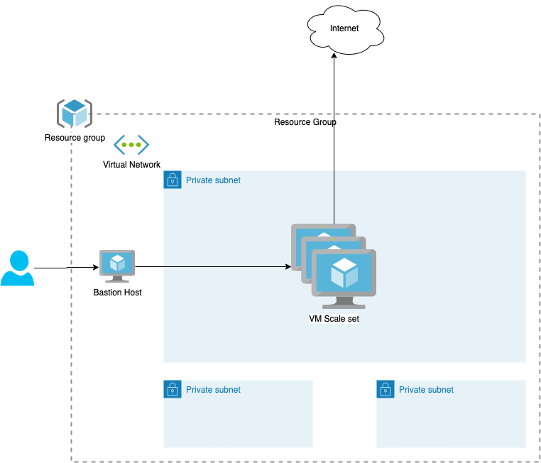

# Azure microsegmentation legacy app infrastructure

This collection of terraform files creates infrastructure that can be used to demonstrate a typical legacy app running in Azure.

### The following resources are created:

* Resource group (aka Azure namespace)
* Virtual private network (VPC) with 3 subnets
* Bastion host
* Virtual scale set of 3 VMs with private IPs accessible via the bastion host



To get started, you will need:

* Linux / Mac / WSL2 with existing ssh public/private key pair in `~/.ssh`
* Azure CLI
    * [install](https://docs.microsoft.com/en-us/cli/azure/install-azure-cli)
    * [authenticate](https://docs.microsoft.com/en-us/cli/azure/get-started-with-azure-cli)
* Terraform
    * [configure](https://learn.hashicorp.com/tutorials/terraform/azure-build) Make sure to create a Service Principal and export the `ARM_*` variables as described in the guide.
* (Optional) jq

### Getting started

* git clone the repo, cd into its directory
* Edit all 3 variables in `variables.tf` to match your prefered zone, your email address, and a prefix for all resource names. For example:
```
variable "owner" {
  default = "jdoe@myworkemailhere.com"
}

variable "prefix" {
  default = "jdoe-lab"
}

variable "resource_group_location" {
  default = "westus2"
}

```
With a configuration like that, John Doe will get a resource group called `jdoe-lab-rg`, a VPC in West US 2 region, named `jdoe-lab-vpc1` etc.

```
terraform init
terraform plan
terraform apply
```

If you would like to connect to the VM instances in the scaleset via your favorite SSH client, once `terraform apply` finishes:

* navigate to your Azure portal, find your bastion host, click on "Configuration"
* check the "Native client support" box. Apply the changes (it takes several minutes) 
* Run `get_connect_bastion.sh` to get a list of azure cli ssh bastion commands. 
* Copy-paste one of the resulting commands in your terminal and you should be tunneled into one of the VM instances. 

Once done, you can `terraform destroy` the whole stack.
