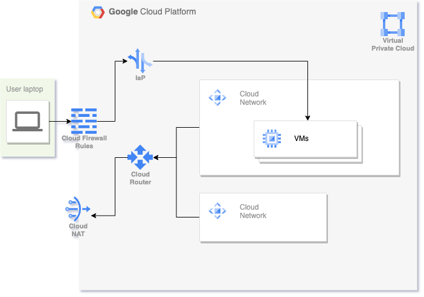

# GCP microsegmentation legacy app infrastructure

This collection of terraform files creates infrastructure that can be used to demonstrate a typical legacy app running in GCP.

## Architecture



This code creates a VPC network with 2 subnets. All VMs in those subnets will use private IPs only, outbound traffic is handled by a cloud NAT instance. 

Connectivity to the VMs is provided via the identity aware proxy in GCP. To SSH into any of them, use the following command:

```
gcloud compute ssh --zone $your-zone $your-vm-name  --tunnel-through-iap --project $your-project
```

There are 2 firewall rules created:
* Allowing SSH from the identity aware proxy to the VMs.
* Allowing all traffic within the subnets.

## Getting started

* git clone the repo, cd into this directory
* Follow the [getting started guide](https://registry.terraform.io/providers/hashicorp/google/latest/docs/guides/getting_started) , particularly the "Configuring the provider" and "Adding credentials" sections. 
* To get your service account authenticated, please consider adding a key to an existing shared IAM user
```
gcloud iam service-accounts keys create pcs-svc-shared.json --iam-account=my-shared-iam-account@my-project.iam.gserviceaccount.com
```
* Edit `variables.tf` to match your environment and preferences. For example:
```
variable "gcp_project" {
    default = "my-project"
}

variable "gcp_region" {
    default = "us-west2"
}

variable "gcp_zone" {
    default = "us-west2-a"
}

variable "prefix" {
    default = "jdoe-lab"
}

variable "owner" {
    default = "jdoe-emailprovider-com"
}

variable "shared_svc_account_email" {
    default = "my-service-accout@myproject.iam.gserviceaccount.com"
}
```

This way all resource names (networks, subnets, VMs, etc) with beging with `jdoe-lab` and will be in US West 2 region.

Then it is as easy as 

```
terraform init
terraform plan
terraform apply
```

Once done with your lab environment, take it down with `terraform destroy`.