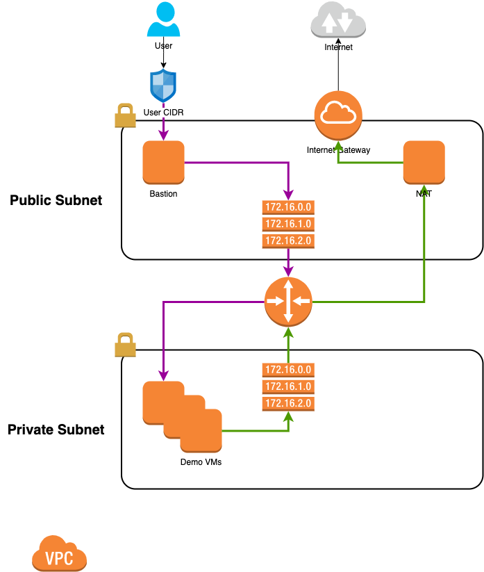

# AWS microsegmentation legacy app infrastructure

This collection of terraform files creates infrastructure in AWS that can be used to demonstrate a typical legacy application.

## Architecture



This code creates the following:

* A VPC
  * Public subnet
    * Internet gateway
    * NAT instance
    * Bastion instance
  * Private subnet
    * Set of VMs for demo purposes

Outbound traffic from the private subnet is routed via the NAT instance in the public subnet.

## Getting started

* make sure you have valid private/public key in `~/.ssh/`
* git clone the repo
* fill out the variables.tf file, for example:

```
variable "aws_profile" {
  default = "sso_power_user"
}

variable "aws_region" {
  default = "us-west-1"
}

variable "prefix" {
  default = "jdoe-lab"
}

variable "owner" {
  default = "jdoe@email-provider.com"
}

variable "my_cidr" {
  default = "123.123.123.0/26"
}

```
* make sure you have the appropriate credentials to run terraform, then
```
terraform init
terraform plan
terraform apply
```

You will get all of your demo VMs in a private natted subnet. To access them through the bastion host:

```
eval $(ssh-agent)
ssh-add ~/.ssh/id_rsa
bastion_ip=$(terraform output -raw bastion_ip)
demo_vm_ips=$(terraform output -raw demo_vm_ips)
echo $demo_vm_ips
ssh -A ec2-user@${bastion_ip}
```
Once inside the bastion host, you can just `ssh <IP of demo vm>`


